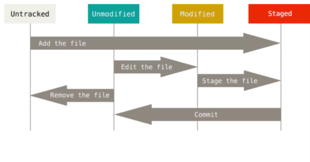
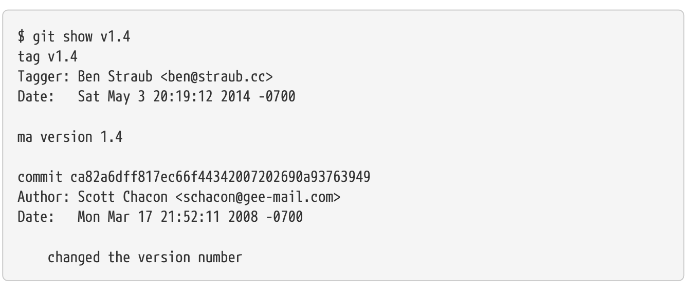

# Bonnes Méthodes du Web & Versioning

## Liens

- *Url Site Markdown : https://www.markdownguide.org/cheat-sheet/*


## Définitions

- *Versioning : La gestion de versions consiste à garder une trace des modifications apportées au code (style base de données). Enregistrements des changements ainsi que des personnes qui les ont faîtes.* 


## Cours

Versioning : 

Traçabilité, collaboration, backup & rétablissement, branching & merging

Nomenclature de Versioning :

Majeure, Mineure, Correctif (Alpha, beta, snapshot)

SVM (SCM?) = Type de Logiciel semblable à GIT


Aperçu des Systèmes de Versioning :

### Subversion (SVN) : Système de contrôle de Versions centralisées

Un serveur centralise toutes les versions (Si le serveur tombe, tout est perdu)

Opérations & Fonctionnalités : 

Checkout/Update/Commit : Récupérer le code / Mettre à jour copie de travail / Envoyer modification (Localement)

Branching & Merging : Branches de projets & Fusions avec les mises à jour envoyées

Dépôts & Repositories = Code source

### Git : Système de contrôle de Versions distribuées

Github / GitLab

### Git en détails :

La principale différence entre Git & d'autres SCMs, réside dans la façon dont Git considère les données. 

Conceptuellement, la plpart des autres SCMs stockent les informations sous la frome d'une liste de modification apportées à chaque fichier au fil du temps.

Alors que Git considère les données comme un ensenble dans un ensemble de snapshot 

#### Avec Git la quasi-totalité des opérations sont locales

#### Git se de gérer l'intégrité des données

Avant la plupart des opérations effectuées, Git effectue une "somme de contrôle" puis obtiens une signature unique qui sert de réf. On peut ainsi vérifier l'intégrité des données. Cela signifie qu'il est impossible de modifier le contenu d'un fichier sans que Git ne le sache.

Le mécanisme utilisé par Git est appelé une empreinte SHA-1. Une chaine de caractères composées de 40 caractères hexadécimaux qui ressemble à cela :

```sh
24d9da66557578921dadfe42b5
```

#### Avec Git très peu d'opérations sont destructives

#### Git à trois états principaux dans lesquels peuvent se trouver vos fichiers :

- **Modifier** : Modifier fichiers dans répertoire (Working Directory)
- **Indexer** : Ajouter les fichiers où les changements auront lieux
- **Valider** : Validations des fichiers

.git -> Zone de travail ->

#### La première utilisation de Git

Git possède un outil appele Git config qui permet de configurer les paramètres de Git sur votre système. Ces params peuvent être stockés dans trois endroits différents :

- [chemin]/etc/gitconfig : Contient les valeurs appliquées a tous les utilisateurs & tous les projets.

- Fichier ~/.gitconfig : Spécifique à l'utilisateur.

- Fichier config dans le repertoire Git d'un dépot en cours d'utilisation (.git/config)

Sur les OS Windows, Git recherche le fichier .gitconfig ( ~ = Tilde)


#### Montrer où est localisé la config git
```sh
git config --list --show-origin
```

#### Configurer votre identité

La première chose que vous devriez faire lorsque vous installez Git est de définir votre nom d'utilisateur & votre adresse e-mail. Ceci est important car chaque validation dans Git utilise cette information et elle est immuablement attachée aux commits que vous validez :

```sh
$ git config --global user.name "John Doe"
$ git config --global user.email "mon@email.com"
```

#### Votre éditeur de texte

VI / VIM : (I = mode insertion, ECHAP = Quitter mode insertion, ":" = mode commande (si pas en mode insertion/edition) "wq" pour sauvegarder & quitter.)
Nano

```sh
git config --global core.editor emacs
```

Sur Windows vous êtes obligés de spécifier le chemin complet de l'éditeur de texte.

```sh
git config --global core.editor "'C:/Program Files/Notepas++/notepad++.exe' -multiInst -notabbar -nosession -noPlugin"
```

#### Le nom de branche par défaut

```sh
git config --global init.defaultBranch main
```

#### Vérifier vos paramètres

```sh
git config --list

git config user.name
```

#### Obtenir de l'Aide

```sh
git help <commande>
man git <commande>

```

## Les Bases de Git

### Démarrer un projet

#### Initialiser un dépot

```sh
git init
```

#### Supprimer un dépot

```sh
rm -rf .git/
```

#### Vérifier l'état du dépots

```sh
git status
```

#### Ajouter tout ce qui se trouve dans le répertoire actuelle dabs le prochain commit

```sh
$git add .
```

#### Supprimer un fichier du prochain commit

```sh
$git rm -cached [fichier]
```

#### Faire un commit

```sh
$git commit
```

#### Cloner un dépot

```sh
git clone https://github.com/R1t0ru/Git_test.git
```

De manière générale on peur résumer le cycle de vie des fichiers dans Git comme suit : 



## Git hub

Profile -> Settings -> Developer Settings -> Personal access tokens, Tokens (classic)

#### Lier un dépot distant avec un dépot local

```sh
git remote add origin <url>
```

Il faudra choisir quel type d'accès utiliser :

- https : pour un accès en lecture seule (read-only)
- ssh : pour un accès en lecture/ecriture (read/write) (clé dans ~/.ssh/id_ed25519) (Clé ssh publique = Identification de la machine)
- Personal Access Token (PAT): pour un accès en lecture/ecriture

Pour lister les remotes :

```sh
git remote -v
```

Pour supprimer un remote :

```sh
git remote rm <remote-name>
```


HEAD = Branche principale

Premier push (permet d'informer git que la branche main doit être synchronisée vers le dépot git (si non existante, création de la branche)) :

```sh
git push -u origin main|master 
```

Pour les push suivants :

```sh
git push 
```

Pour cloner un depot :

```sh
git clone https://github.com/bendahmanem/ISITECH-2324-B2-DEV-Versioning
```

#### Ignorer des fichiers

Pour ignorer des fichiers il suffit de créer un fichier .gitignore et d'y ajouter les fichiers et les dossiers a ignorer.

Le fichier .gitignore agit de façon récursive sur les sous-dossiers.

#### Consulter l'état des fichiers

```sh
git status
```

```sh
git diff
```

Git status présente l'état global du dépot, modifié ou non. Git diff présente les modifications apportées aux fichiers.

On peut utiliser git diff de façon plus précise :

```sh
git diff --staged
```

#### Valider des modifications

```sh
git commit -m "message"
```

#### Effacer des fichiers

Pour éliminer un fichier il faut utiliser les commandes suivantes :

```sh
rm <fichier>

git status

git rm <fichier>
```

Cette dernière commande indexe le fichier pour qu'il soit supprimé dans le prochain commit.

Il existe une autre forme de suppression de fichier :

```sh
git rm --cached <fichier>
```

Cette commande va supprimer le fichier de l'index mais pas du disque dur.

#### Visualiser l'historique des commits

```sh
git log
```

Options de commande log :

```sh
git log --stat
```

```sh
git log --pretty=oneline
```

Cette commande affiche chaque commit sur une seule ligne.

```sh
git log --pretty=format:"%h %s" --graph
```

Cette commande affiche affiche l'historique sous forme d'un graphe.


####

```sh
git commit --amend
```


```sh
git reset HEAD <fichier>
```

Cette commande permet de retirer un fichier de l'index.

#### Désindéxer des éléments déjà commits

```sh
git checkout <branche>
```

#### Création de tags (étiquettes)

En plus d'identifier les commits par des identifiants uniques, Git vous permet aussi d'étiqueter un certain état de l'historique (commit) comme étant important. Cela peut être utile pour marque des versions de votre code source.

```sh
git tag -a v1.0 -m "Version 1.0"
```

On peut lister les tags avec la commande suivante :

```sh
git tag -l "v1.8.5*"
```

Visualiser une étiquette :

```sh
git show v1.4
```



Faire attention aux dons d'accès aux personnes avec qui on travaille